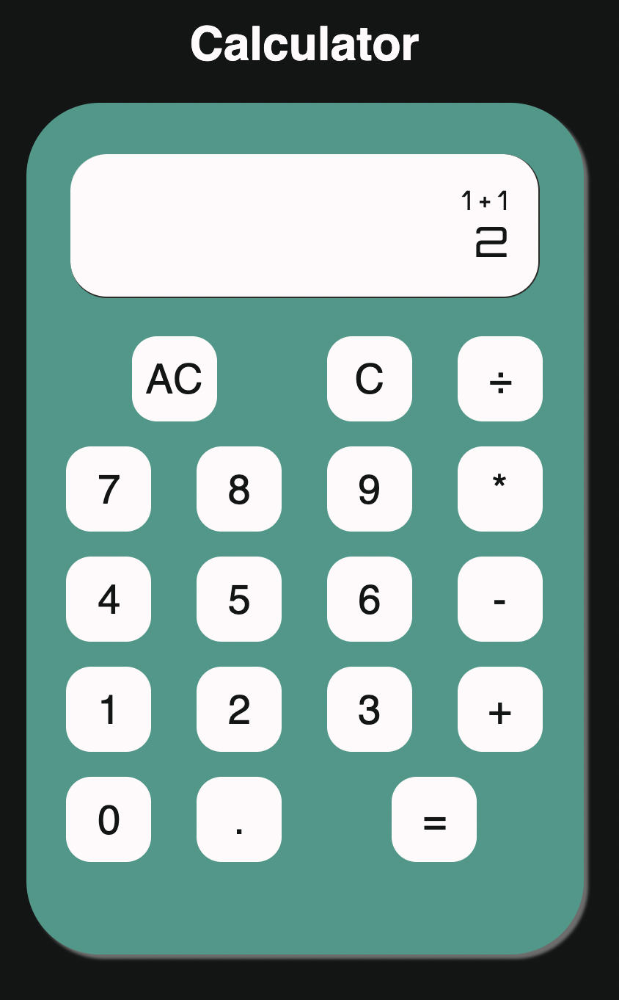
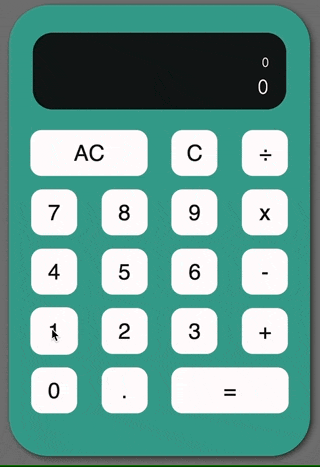
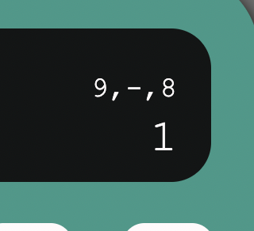
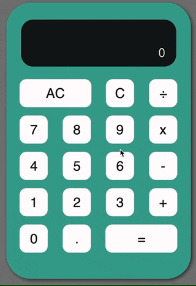

# Calculator

Project started: 5th November 2021 

### Resources

* [The main project page on the Odin Project](https://www.theodinproject.com/paths/foundations/courses/foundations/lessons/calculator)  
* [This project from section.io](https://www.section.io/engineering-education/building-a-calculator-a-javascript-project-for-beginners/)  


<br>

## Setting Up

Firstly let's think about what you want to do with a calculator. Add some numbers, multiply them, subtract, divide. We also need to be able to clear the screen. So let's go ahead and add some buttons and basic styling.  

*fast-forward >>*  

[](./images/screenshot-calculator01.png)

The screen is divided into two parts - the main part of the screen will hold the value of whichever number button has been pressed. The smaller top part of the screen will hold the formula we are going to calculate.   
At this point I'll set an exact size of the screen parts so *for now* I don't need to worry about how they will look when there's no value in them.  

```
.screen-top {
    height: 22px;
    width: 279px;
}

.screen-main {
    font-size: 28px;
    height: 35px;
    width: 279px;
}
```

*Dealing with overflow of numbers*  
We still want the numbers to be present so we can perform calculations on them if necessary. But we don't want to be able to see them. A quick hack to deal with this for now and we'll come back to rounding later. 

```
    word-wrap: break-word;
    word-break: break-all;
    overflow: hidden;
    line-height: 2;
```

The AC button and = button are supposed to span two columns in the grid layout, however I don't want to waste too much time mucking around with the layout (an easy trap to fall into!) so let's move on to the script.  

<br>

## The Basics

Thinking firstly about the steps involved in using a calculator, and also reviewing the tips from [the project page](https://www.theodinproject.com/paths/foundations/courses/foundations/lessons/calculator).  

<br>

### Steps

```
click button  
if number, display on screenMain  
if there is a number on screenMain, next number should append to its right  
    if (screen contains numbers) { screenValue + button.id}  
if operand is clicked, move first number to top of screen  
    operands: add, subtract, divide, multiply  
store top of screen contents in currentTopValue  
when = is clicked, calculate currentTopValue  
if screenTop is 1 + 1, if the next button is a number append it (eg 1+1 becomes 1+12) OR if it's an operator, calculate (1+1) and display that on screenMain  
- limit amount of numbers than can appear on the screen - round longer numbers?  
- disable decimal if there's already one on the screen  
    if (screen contains decimal) { disable decimal button }  
- pressing clear should clear the data in all 'current' variables  
- extra credit: backspace, keyboard & pointer support   
```

<br>

## The Script

Firstly grab the two `div`s that will hold the two parts of the screen - the main and the top - and hold them in a variable each. Create a variable for each to hold the current value. Then set the `textContent` of each to display...something.  

```
const screenMain = document.querySelector('.screen-main');
let currentMainValue;
screenMain.textContent = currentMainValue;

const screenTop = document.querySelector('.screen-top');
let currentTopValue;
screenTop.textContent = currentTopValue;
```
Now let's get an event listener on the buttons, so we can click a button and show the value of that button on the screen.

```
buttons.forEach((button) => {
    button.addEventListener('click', () => {
      currentMainValue = button.id;
      screenMain.textContent = currentMainValue;
    })
});
```

Cool, it works. But we actually only want numbers to display on the screen. I tried creating a function using an `if` statement based on `.classList.contains()` and used that as a callback function, but got a TypeError reading properties of undefined. [This project from section.io](https://www.section.io/engineering-education/building-a-calculator-a-javascript-project-for-beginners/) suggests using data-attributes instead of classes so let's give that a go.  
Rather than noodling around with classes, we can use `hasAttribute` to check if a specific data-attribute is present.  

<br>

### Functions

So firstly I'll make some very basic functions for each method and see if I can get that to work. 

```
const add = function add(number1, number2) {
    return number1 + number2;
}
```

Refresh to page, test it out in the browser, it works.  
Now let's mash them all together in a switch statement.

```
function calculate(operand, number1, number2) {
    switch(operand) {
        case add:
            return add(number1,number2);
        case subtract:
            return subtract(number1,number2);
        case multiply:
            return multiply(number1,number2);
        case divide:
            return divide(number1,number2);
        default: 
            console.log("no operand");
    }
}
```

Two things: firstly, I was calling a function for each case, but not actually returning anything. This might not be necessary on building the code further but needs it work now! Secondly, I was treating each case as a string and it was returning undefined??? I fixed this by putting each function into a variable and treating each case as a variable instead of a string.  

Next we need to work on the logic. I'll do this by writing out the pseudocode and figuring out the order from there, and then rewriting that into actual code.  
A little snippet of what that would look like:  
```
Check if button is a number
  Check if there’s a number on main screen
    If there is, add the new number to it (1+1 = 11, not 1+1 = 2)
    If there isn’t, show the current number on main screen
  if button isn't a number, check if it's an operand
    ... 
```

First let's look at what to do if the button is a number. This will end up looking something like this:  
```
function handleClick(button) {
    if ('number' in button.dataset) { 
        currentMainValue = button.id;
        screenMain.textContent = currentMainValue;
    } else {
        console.log('button was not a number')
    }
}
```

What I tried and what didn't work/did work: if the button that was clicked had a specific data-attribute:  
* `button.hasAttribute('[data-number]');` returns FALSE
* `button.dataset['number'];` returns FALSE  
Instead:  
* `'number' in button.dataset;` returns TRUE! [Thanks MDN](https://developer.mozilla.org/en-US/docs/Web/API/HTMLElement/dataset)

*Some things we need to look out for:*
* Only when the = is clicked do we want to actually perform any calculation. As shown above if there's already a number in the main screen we want to put the next number next to it. Eg 1 becomes 11, not 1+1. However we can't call the calculator function until we have a whole formula. 
* if a decimal point is already present in the number we want to prevent another one being added
* storing the operand in its own variable eg `currentOperand` saves trying to perform calculations on a string

<br>

### the Clear button
```
function clear(number) {
    let string = number.toString();
    let newString = string.slice(0,-1);
    let newNumber = parseInt(newString);
    currentMainValue = newNumber;
    return screenMain.textContent = currentMainValue;
}
```
[](./images/screenshot-calculator-NaN.gif)

The clear button does delete the last digit from a number perfectly - but once it runs out of numbers, we end up with NaN. Then when we click another number we end up with something like `NaN123`. We should prevent it from reaching NaN in the first place. Let's check if the length of the number is 1 (ie if there is only one digit) and if so, we don't need to remove the last digital. We'll just reset the number to 0. 

```
function clear(number) {
    if (number.length === 1) {
        currentMainValue = 0;
        return screenMain.textContent = currentMainValue;
    } else {
    let string = number.toString();
    let newString = string.slice(0,-1);
    let newNumber = parseInt(newString);
    currentMainValue = newNumber;
    return screenMain.textContent = currentMainValue;
    }
}
```

Guess what guys - `length` isn't a method you can use on a type of `number`. What I'm trying to do is find out if the number is a single digit, right? This is a little long-winded but I'm instead going to check if the number is 9 or lower (a single digit) and if so, reset my screen value to 0. If it's 10 or higher (more than one digit!) then we'll run our string method code block.  

```
function clear(number) {
    if (number === 0) {
        currentMainValue = 0;
        return screenMain.textContent = currentMainValue;
    } else if (number <= 9) {
        currentMainValue = 0;
        return screenMain.textContent = currentMainValue;
    } else if (number > 10) {
        let string = number.toString();
        let newString = string.slice(0,-1);
        let newNumber = parseInt(newString);
        currentMainValue = newNumber;
        return screenMain.textContent = currentMainValue;
    } else {
        return console.error("ERROR");
    }
};
``` 

**It works!**  
One more thing - setting the screen text to 0 creates problems because the functions are all based around the content of the variable (`currentMainValue`) so that *has to be set first*. Then we assign it to the `textContent`.  

<br>

### The Decimal Point

I can work around whether there is a decimal point in the number displayed by creating a variable `decimalActive = false` and setting it to `true` once the decimal button is clicked. Maybe this can be cleared once the equals button is pressed? Come back to this.  

In terms of adding the decimal point on the screen, it makes sense that we use the same concept as when adding another number (ie 1+1 = 11, 1+. = 1.). 

```
function decimalPoint(number) {
    let decimalAdded = number += ".";
    let newNumber = parseInt(decimalAdded);
    currentMainValue = newNumber;
    return screenMain.textContent = currentMainValue;
}
```

On a regular calculator the decimal point is either always visible, or appears as soon as you press the . button. The function above is supposed to make it appear. HOWEVER, while `number += ".";` adds the decimal point, `parseInt` immediately removes it when turning the string back into a number.  
Chaining [`toFixed(1)`](https://developer.mozilla.org/en-US/docs/Web/JavaScript/Reference/Global_Objects/Number/toFixed) onto the `parseInt` method solves this...but then clicking another number button appends the number after the 0. This project is hilarious.  
So we want to do something like replace the ".0" with ".1" instead of ".01". Let's put this in our `handleClick` and see what happens.  
```
else if (decimalActive) {
            parseInt(currentMainValue) + `.${button.id}`
```
**Quick note: make sure to set `decimalPoint` back to false on both clear and all clear cases!**

* `parseInt()` converts the number back into an integer.  
* `parseFloat()` returns the number as an integer if nothing (or 0) is after the decimal point.  
* `toFixed()` keeps or converts the number into a string.  

Where to handle making sure we are working with numbers in the final calculation but also controlling how the numbers are displayed? By using 'Number()' in the individual addition etc. function:  
```
const add = function add(num1, num2) {
    return Number(num1) + Number(num2);
}
```
This works a treat...so far!


<br>

### Making the calculator calculate

Looking at some different ways to handle the input. One way is to store the operand in a variable, and the numbers being operated on in separate variables and pass them into the function as separate parameters.  

If we make the parts that will make up the formula into an [array ‘stack’](http://web.archive.org/web/20110619035044/http://aymanh.com/9-javascript-tips-you-may-not-know) we can read the specific indexes of the array to perform our calculation.  

Say we have an array `x = [1, “*”, 1]`

```
function operate(num1, operand, num2) {
    let parameters = Array.from(num1,operand,num2);
    switch(parameters[1]) {
        case add:
            return add(parameters[0],parameters[2]);
}
}
```
This only works if the * etc. can be recognised as a string meaning we change the switch statement cases to match, so `case add` becomes `case "+"`. The case has to return true for its code to run. 

Another goof: why are we passing individual arguments into the function when we are supposedly adding the elements to a stack? Why not just pass an array? Silly.  
```
function operate(array) {
    switch(array[1]) {
        case "+":
            return add(array[0],array[2]);
        ...
```

Making the top value show the formula is cool but if it's just a straight up array it looks pretty ugly:  

  

What we can do is use the [array.join('') method](https://sebhastian.com/javascript-array-string/) where the indexes of the array can be joined into a string, and the '' just means there is no separator.  
[](./images/screenshot-calculator-operate.gif)  
Sort of works. 

Now the next thing to tackle is where the = prompts a calculation on the array in the top value.  
Say it's "1 + 2" which appears in the top screen, and outputs "3" in the main screen. 
* If we press = again we want to take the output value of 3 and add the last number pressed (2) to it. 
* If we press - we have to replace the top value with "3 - " and if we then press * we have to replace the top value with "3 * " etc.
* If we press another number, we have to clear the top value and set the main screen to show the new number only.  

```
currentTopValue[0] = currentMainValue;
            screenTop.textContent = currentTopValue.join('');
            
            let result = operate(currentTopValue);
            currentMainValue = result;
            screenMain.textContent = currentMainValue;
```

<br>

## Operands

Ok so if an operand is pressed we are preparing to calculate whatever is in the top value. The problem is that I have a case for if the operand is active, the main value would be replaced with whatever number was pressed. 
Cool. But then, the flaw in my logic was that numbers of more than one digit wouldn't work - it was just replacing whatever the current value was.
Eventually I realised I needed to set the active operand variable BACK TO FALSE (!) which allowed me to then keep appending numbers to the main value.  

Another problem: when performing a calculation, say we go `1 + 2 * 10` without pressing equals in between, we want the calculator to operate as " `(1+2) * 10` ".  
Similarly if we DO press equals - `1+2 = 3` - then press *, we want to perform 1+2 and store the result i in topvalue, with the new operand, as `[${result},"*",]`.  


### [More steps](https://www.theodinproject.com/paths/foundations/courses/foundations/lessons/calculator)

* Display a snarky error message if the user tries to divide by 0… don’t let it crash your calculator!

```
const divide = function divide(num1, num2) {
    if (num2 == 0) {
        alert("Cannot divide by zero - resetting values")
        return allClear();
    } else {
    return Number(num1) / Number(num2);
    }
}
```

* Create the functions that populate the display when you click the number buttons.  

* You should be storing the display value in a variable somewhere for later use.

* Store the first number that is input into the calculator when a user presses an operator, and also save which operation has been chosen and then operate() on them when the user presses the “=” key.